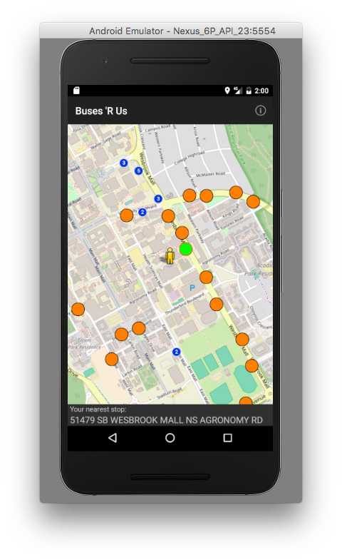
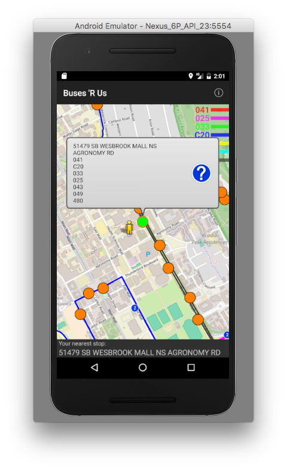
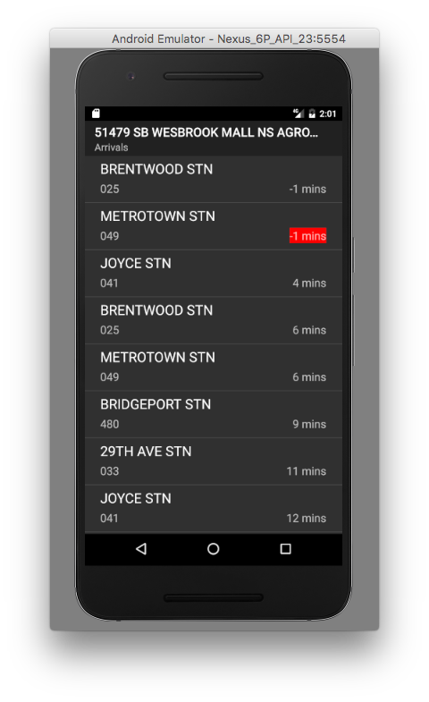

# Buses R Us 🚌

An Android application that maps the location of stops and bus routes on the Greater Vancouver Transit system. The user's location is plotted on the map and highlights the nearest bus stop. It retrieves real time arrival information using the TransLink Open API.
This application was created as a final project for CPSC 210 at UBC.

## Usage
- The closest stop to you will be highlighted and displayed at the bottom of the screen.
- Clicking on a stop will display upcoming bus arrival times and display its route.

## Installation
1. Navigate to /out/production/BusesAreUs_Phase2 within this repo and download the APK file. 
2. Connect your Android device to your computer and copy the APK file into a folder on your device.
3. Search for the file location on your device and tap to install.

## Screenshots

</div
